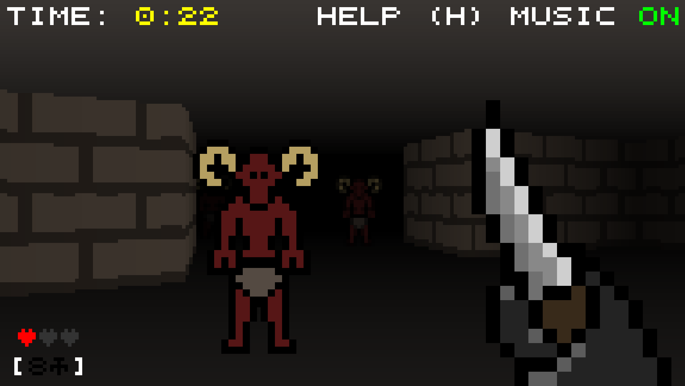

It was Ludum Dare again this weekend, this time with the theme *Combine
2 Incompatible Genres*. I chose to mix Solitaire with a Dungeon Crawler.

Click the picture to try the game. Alternatively, you can try the [compo
version](/games/dungeon-solitaire/compo-version) which is what I managed to make
within the competition time limit.

If you get stuck, try reading through the README file on the code page linked
below.

  * [Ludum Dare Entry](https://ldjam.com/events/ludum-dare/41/dungeon-solitaire)
  * [Code](https://github.com/Scrumplesplunge/ludumdare41)
