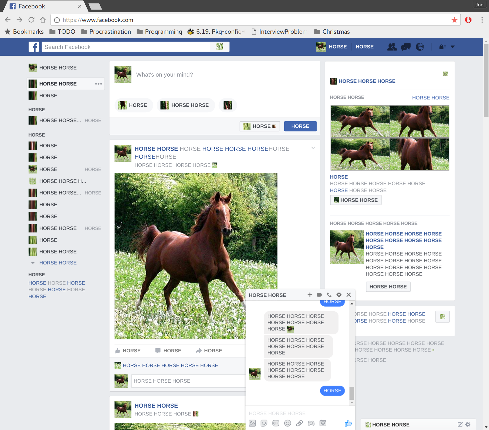

This rather opaque code snippet:

    javascript: setInterval(function(){
      function d(e) {
        var c = e.childNodes;
        for(var i = 0; i < c.length; i++) {
          if (c[i].nodeType == 3) {
            c[i].nodeValue = c[i].nodeValue.replace(/[^\s]+/g, "HORSE");
          } else if (c[i].nodeType == 1 && c[i].tagName == "IMG") {
            var cs = window.getComputedStyle(c[i]);
            var x = cs.width, y = cs.height;
            c[i].src = "http://bit.ly/vcrd56";
            c[i].style.width = x;
            c[i].style.height = y;
          } else if (c[i].nodeType == 1 && c[i].tagName == "I") {
            c[i].style.backgroundImage = "url('http://bit.ly/vcrd56')";
          } else {
            d(c[i]);
          }
        }
      }
      d(document.body);
    }, 1000);

when pasted into the address bar on Facebook, achieves something beautiful:

I offer no justification for this script, but thank my cousin Tom for the
inspiration.
