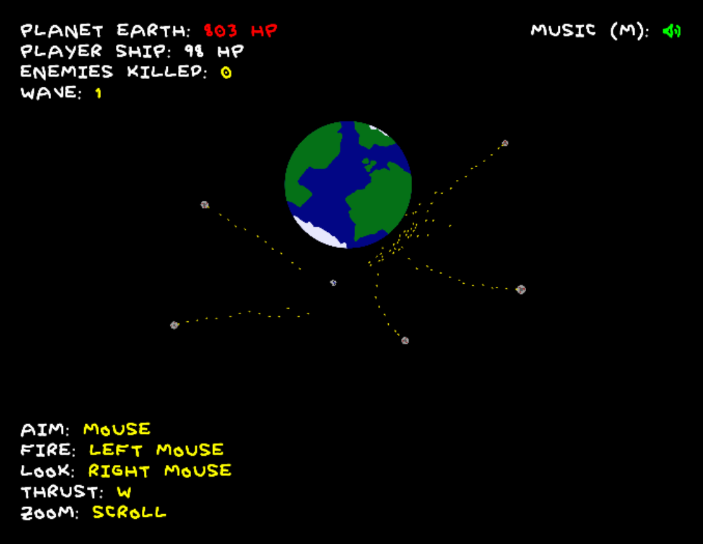

Last weekend, I took part in [Ludum Dare 38][1] and made a game. The theme of
the competition was *A Small World* which I, like what seems to be everybody
else, took literally.

[1]: https://ldjam.com/events/ludum-dare/38

Click the picture to try out the game.

My game is called *Defend the Earth* and is a little space shooter. You are the
sole defender of planet Earth against an alien invasion, and basically have to
fight off waves of flying saucers. The key features are bullets which ricochet,
n-body gravity, and debris from destroyed objects.

The competition rules state that everything in the game must be made completely
from scratch within the 48 hours of the competition, excluding small things like
sound samples or procedurally generated content if they are used to form
a derivative work. My game is written completely from scratch in plain
JavaScript, with all the graphics drawn by me and all the sounds made with
a combination of synthesis, my voice, and my finger tapping the mic.

The source code is available on [GitHub][2], and I also recorded two timelapses
on [Saturday][3] and [Sunday][4] respectively if you want to watch me making it.

[2]: https://github.com/Scrumplesplunge/defendtheearth
[3]: https://youtu.be/ngtcl5vMzdg
[4]: https://youtu.be/o7eCZhgxUD8
