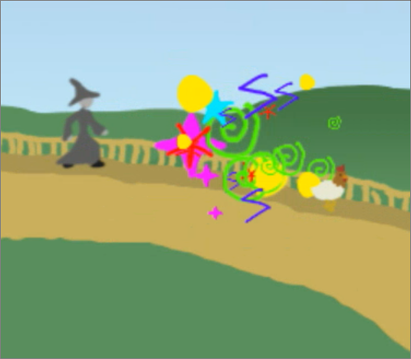

This weekend I took part in [Ludum Dare 39][1]. The theme was *Running Out Of
Power*, so I decided to make a sidescroller with a draining health bar and some
puzzles to complete.

[1]: https://ldjam.com/events/ludum-dare/39

Click the picture to try out the game.

This is the first time I have ever written a side-scroller. Usually I stick with
top-down games because I never wanted to try and deal with the fiddly physics
stuff necessary to make controls work. However, it turned out much better than
I was expecting. I was able to implement a simple physics engine which could
determine whether the player was on the ground, use this information to change
the character sprites appropriately, and even make a simple level editing tool
to speed up the process of applying the scenery mesh to the background image.

# Plot

The plot is pretty generic. You are a wizard who has been cursed by Wizardy
McVillainFace. The curse is slowly draining your power, and you must traverse
a bunch of levels in search of a cure for your affliction.

I'm sure that this plot would've held a lot more significance if I had time to
actually put the cure, or a final encounter with Wizardy McVillainFace into the
game.

# Conclusion

I really felt like I could have added a lot more to this game. The biggest thing
reported in the comments from reviewers was that it needed more levels, and
I completely agree. I only had time to make two. If I had been given more time, 
this would have been the first thing that I would have dealt with. Beyond that,
this game has no sound effects. I feel like the sound effects in [my previous
game][2] were a big part of what made it fun.

[2]: /games/defend-the-earth
